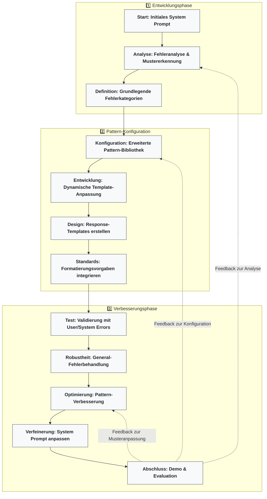

```mermaid
flowchart TD
    %% Main nodes with better descriptions
    A[Start: Initiales System Prompt] --> B[Analyse: Fehleranalyse & Mustererkennung]
    B --> C[Definition: Grundlegende Fehlerkategorien]
    C --> D[Konfiguration: Erweiterte Pattern-Bibliothek]
    D --> E[Entwicklung: Dynamische Template-Anpassung]
    E --> F[Design: Response-Templates erstellen]
    F --> G[Standards: Formatierungsvorgaben integrieren]
    G --> H[Test: Validierung mit User/System Errors]
    H --> I[Robustheit: General-Fehlerbehandlung]
    I --> J[Optimierung: Pattern-Verbesserung]
    J --> K[Verfeinerung: System Prompt anpassen]
    K --> L[Abschluss: Demo & Evaluation]
    
    %% Improved feedback loops with labels
    L -.->|Feedback zur Musteranpassung| J
    L -.->|Feedback zur Konfiguration| D
    L -.->|Feedback zur Analyse| B
    
    %% Better visually distinct subgraphs
    subgraph Phase1["1️⃣ Entwicklungsphase"]
        A; B; C
    end
    
    subgraph Phase2["2️⃣ Pattern-Konfiguration"]
        D; E; F; G
    end
    
    subgraph Phase3["3️⃣ Verbesserungsphase"]
        H; I; J; K; L
    end
    
    %% Enhanced styling
    classDef phaseOne fill:#e6f7ff,stroke:#4dabf7,stroke-width:2px
    classDef phaseTwo fill:#e3fafc,stroke:#3bc9db,stroke-width:2px
    classDef phaseThree fill:#e6fcf5,stroke:#38d9a9,stroke-width:2px
    classDef node fill:#f8f9fa,stroke:#495057,stroke-width:1px,color:#212529,font-weight:bold
    
    class A,B,C phaseOne
    class D,E,F,G phaseTwo
    class H,I,J,K,L phaseThree
    class A,B,C,D,E,F,G,H,I,J,K,L node
```